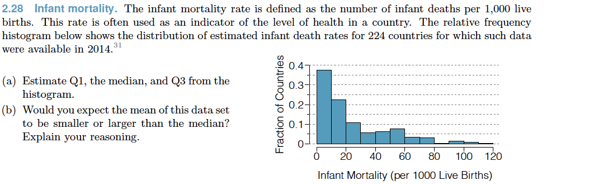
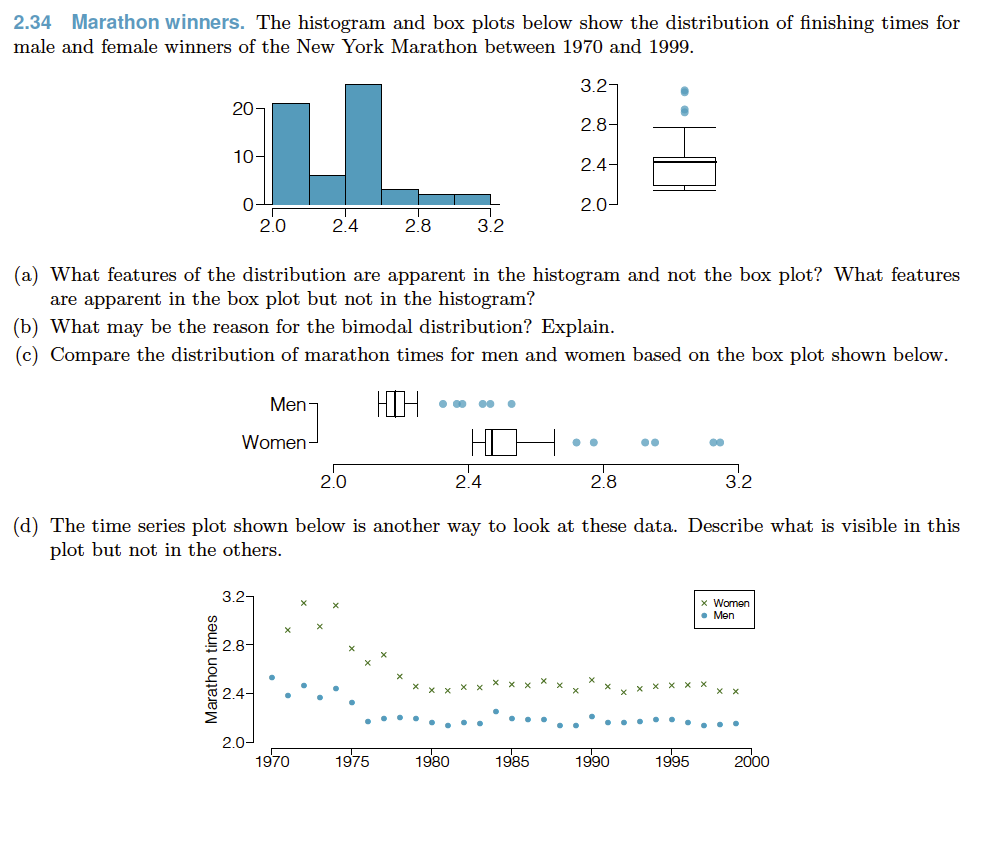

> The following problems test your ability to read histograms, boxplots, and dotplots. These are common plot types used in empirical research. It is important that you understand their features

1.  2.28 from OpenInto Statistics: 

2. 2.34 from OpenIntro Statistics 

3. Describe the concept of *missing completely at random*. How is this different than *missing at random*? Is it related to the concept of *attrition bias*? 

4. Describe a scenario where data would be missing at random. In a secondary data analysis (i.e., where you do not collect your own data, but rely on data already collected), are we able to confirm if data is missing at random? Why or why not?

## Computer exercises

1. Import the `master.csv` data file 

> This is a compiled data file pulled from four sources and linked by time and place. The data file includes nation-level suicide rates and measures of socioeconomic status. Data has been pulled from the World Health Organization, United Nations, and the World Bank. 

2. Create a grouped dataset that includes suicide rates over time by country and sex (you should end up with two rows in your data per country per year)

> This is a tricky exercise if you are new to data manipulation, so take your time. If this step is giving you trouble, then you can skip it by using the `master_grouped.csv` data file where I can completed the grouping for you. However, I would encourage you to return to this exercise until you get it. 

3. Plot the distribution of suicide rates in 2013 in all countries and stratified by sex. How would you describe this distribution (e.g., skewed, multi-modal, peaked). Could you group countries into different clusters based on their rates?

4. Identify any outliers in 3. Which countries would be considered outliers? 

5. Examine the relationship between GDP per capita and suicide rates in 2013. Is the relationship different for men compared to women? 

6. Plot the trend of suicide rates in Canada over time and stratified by sex. 

